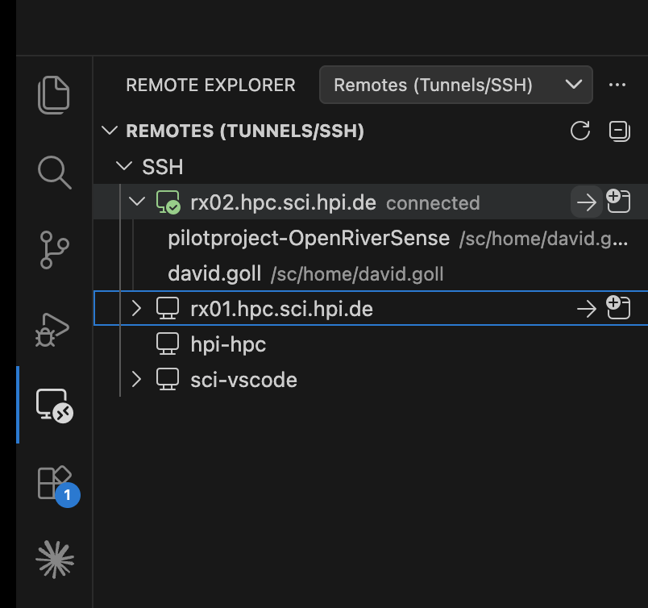
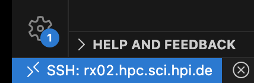

<div style="background-color: #ffffff; color: #000000; padding: 10px;">

<h1> AISC Cluster Workshop: Introduction to SLURM</h1>
</div>

This repository contains materials for the **2-hour HPC Cluster Workshop** by the [AI Service Centre Berlin-Brandenburg (AISC)](http://hpi.de/kisz). Participants learn how to access the AISC/HPI cluster, understand the basics of SLURM, and run GPU workloads independently.

## Workshop Structure

| Part | Topic | Duration |
|------|-------|----------|
| **I** | Introduction: What is a cluster? What is the AISC cluster? | 5 min |
| **I** | Interactive: Cluster access setup | 20-30 min |
| **I** | SLURM basics: partitions, GPUs/CPUs, accounts, fairshare | 10 min |
| **I** | Rules and best practices | 5 min |
| **I** | VSCode Installation | 5 min |
| | *Break* | |
| **II** | Interactive SLURM workflow | 10-20 min |
| **II** | Slides: Basics of CPUs/GPUs and fairshare | 10-20 min |
| **II** | Cloning of repository | 10-20 min |
| **II** | UV installation & Python environment setup (`02_setup_uv`) | 10 min |
| **II** | Batch scripts: from hello world to multi-GPU training (`01`-`08`) | 20 min |
| **II** | Homework: Write your own sbatch script | - |

## Getting Started

### Cluster Access Setup

You can find all of this information in the [Scientific Compute Documentation](https://docs.sc.hpi.de). 
Please note that the Docs provide information for the [general HPI HPC](https://docs.sc.hpi.de/cluster/Resources/Partitions/), of which the [AISC infrastructure](https://docs.sc.hpi.de/aisc/) is a part of.
We outline the important steps below:

1. Get access via the AISC portal by submitting a [proposal](https://aisc.hpi.de/portal/cfp/): 
2. When your account is created, you should receive a .zip file via mail, containing your username, initial password, and, crucially, an .ovpn file.
3. Set your password via the steps explained in the .zip file
4. Set up a [VPN connection](https://docs.sc.hpi.de/VPN/) and keep it running
5. Set up a SSH connection with the cluster by following the steps outlined to the left in [SSH guide](https://docs.sc.hpi.de/ssh/)
6. With your VPN connection **active**, connect to the cluster via SSH: 
   `ssh user.name@hpc.sci.hpi.de` 

> ***Optional:***
> Instead of typing the full address every time, create or edit `~/.ssh/config` and add:
> ```
> Host hpi-hpc
>     HostName hpc.sci.hpi.de
>     User user.name
> ```
> After saving, you can connect with just `ssh hpi-hpc`.
> You can replace `hpi-hpc` with any alias you prefer.

7. Once you are connected, please take some time to familiarise yourself with the basic concepts of [SLURM](https://docs.sc.hpi.de/cluster/SLURM/Basics/), [jobs](https://docs.sc.hpi.de/cluster/SLURM/Job-Examples/#playground-examples) (especially SBatch files), [partitions](https://docs.sc.hpi.de/cluster/Resources/Partitions/) (only the aisc-... partitions are relevant for you), and [run nodes](https://docs.sc.hpi.de/cluster/Resources/Run-Nodes/), `nvidia-smi`, ...

### Setting up a Connection with VSCode

When you log in via `ssh user.name@hpc.sci.hpi.de` you are connected with one of the [login nodes](https://docs.sc.hpi.de/cluster/Resources/Login-Nodes/), e.g. `lx01`. The login nodes are only intended for submitting jobs to Compute nodes, inspect the cluster status, and manage your files. You cannot execute scripts on the login nodes. *They are also not intended for a connection to VSCode.* For this, please use one of the [run nodes](https://docs.sc.hpi.de/cluster/Resources/Run-Nodes/). 

1. In VSCode, open the Command Palette: Shift + Command + P (Mac) / Ctrl + Shift + P (Windows/Linux).
2. Enter `Remote-SSH: Add New SSH Host...`
3. Enter your username and the run node address in the following format: `user.name@rx01.hpc.sci.hpi.de` / `user.name@rx02.hpc.sci.hpi.de`
4. This will write the following information to your `~/.ssh/config` file: 
>      Host rx01.hpc.sci.hpi.de
>         HostName rx01.hpc.sci.hpi.de
>         User user.name
5. Now you should be able to connect easily to the run nodes via the Remote Explorer on the left in VSCode:



6. Once you are connected, you should see the following in the bottom left corner:



7. After your session is finished, click on the blue button in the bottom left and `Close Remote Connection`


## Interactive SLURM workflow

- ToDo: Add brief instructions on how to install interactive tool and how to use it.
- For more details, please take a look at https://github.com/aihpi/tool-interactive-slurm


## SBATCH Scripts

The `scripts/` directory contains a progressive series of SLURM batch scripts (`.sh`) and their corresponding Python scripts (`.py`). Each builds on the concepts from the previous one.

| Script | Topic | Command |
|--------|-------|---------|
| `01_hello_world` | Basic SLURM job submission and logging | `sbatch scripts/01_hello_world.sh` |
| `02_setup_uv` | Install UV and Python dependencies. For more information on UV, please read the [UV docs](https://docs.astral.sh/uv/) | `sbatch scripts/02_setup_uv.sh` |
| `03_gpu_basic` | Verify GPU allocation with `nvidia-smi` | `sbatch scripts/03_gpu_basic.sh` |
| `04_data_setup` | Download datasets to shared project storage | `sbatch scripts/04_data_setup.sh` |
| `05_python_training` | Train a simple CNN on MNIST (single GPU) | `sbatch scripts/05_python_training.sh` |
| `06_array_jobs` | Hyperparameter sweep with SLURM array jobs | `sbatch scripts/06_array_jobs.sh` |
| `07_single_gpu` | Train ResNet-18 on CIFAR-100 (single GPU) | `sbatch scripts/07_single_gpu.sh` |
| `08_multi_gpu` | Train ResNet-18 on CIFAR-100 (4 GPUs with Accelerate) | `sbatch scripts/08_multi_gpu.sh` |

Scripts `05`-`06` use MNIST with a small CNN for fast iteration. Scripts `07`-`08` switch to CIFAR-100 with ResNet-18 — a larger model and dataset that makes the multi-GPU speedup clearly visible.

## FAQ & Troubleshooting

For general cluster issues, see the [Scientific Compute FAQ](https://docs.sc.hpi.de/FAQ/).

| Problem | Likely Cause | Fix |
|---------|-------------|-----|
| Job stuck in PENDING | Partition full or wrong `--account` | Check with `squeue --me`; verify `--account=aisc` and `--partition=aisc-batch` |
| `CUDA not available` | Missing GPU allocation | Add `--gpus=1` to your sbatch script |
| `ModuleNotFoundError` | Python environment not set up | Run `uv sync` first; use `uv run python` instead of `python` |

## References

- [Scientific Compute Documentation](https://docs.sc.hpi.de)
- [AISC Infrastructure](https://docs.sc.hpi.de/aisc/)
- [SLURM Basics](https://docs.sc.hpi.de/cluster/SLURM/Basics/)
- [SLURM Job Examples](https://docs.sc.hpi.de/cluster/SLURM/Job-Examples/)

## Author
- [David Goll](https://github.com/golldavid)
- [Felix Boelter](https://github.com/felixboelter)

## License

This project is licensed under the MIT License - see the [LICENSE](LICENSE) file for details.

---

## Acknowledgements


The [AI Service Centre Berlin Brandenburg](http://hpi.de/kisz) is funded by the [Federal Ministry of Research, Technology and Space](https://www.bmbf.de/) under the funding code 01IS22092.
